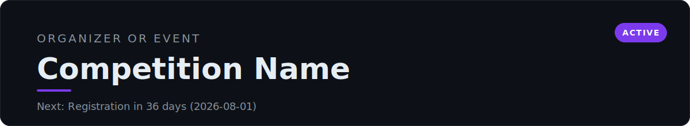
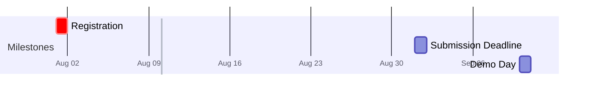

<!-- AUTO:START -->
<!-- Generated by scripts/render.py. Do not edit inside this block; edit competition.yml. -->

> Next milestone: **Registration**, 8 days remaining (2026-08-01).

## Timeline

## Deliverables

- [ ] Project proposal
- [ ] Working prototype
- [ ] Demo video
- [ ] Pitch deck

## Resources

_No resources linked yet._

Last updated 2026-07-24

<!-- AUTO:END -->

## Problem statement
_What are we solving, and why does it matter? This section is free-form and is never overwritten by automation._

## Approach
_Our solution, the architecture, and the stack._

## Demo
_Screenshots, recordings, or a link to the live demo._

## Notes
_Rules, judging criteria, ideas, and open questions the team should remember._

## Results
_Outcome and reflections. Update after judging._
